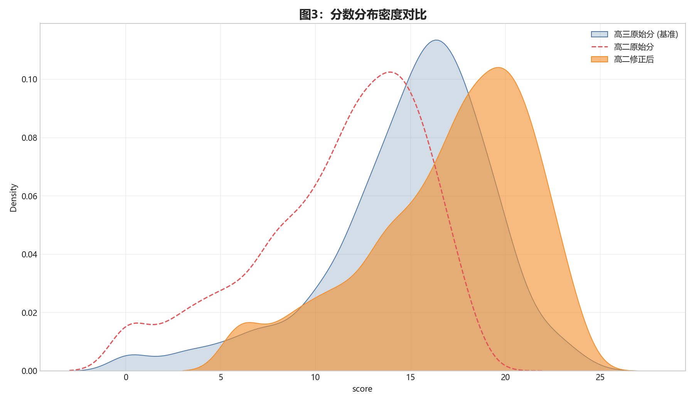
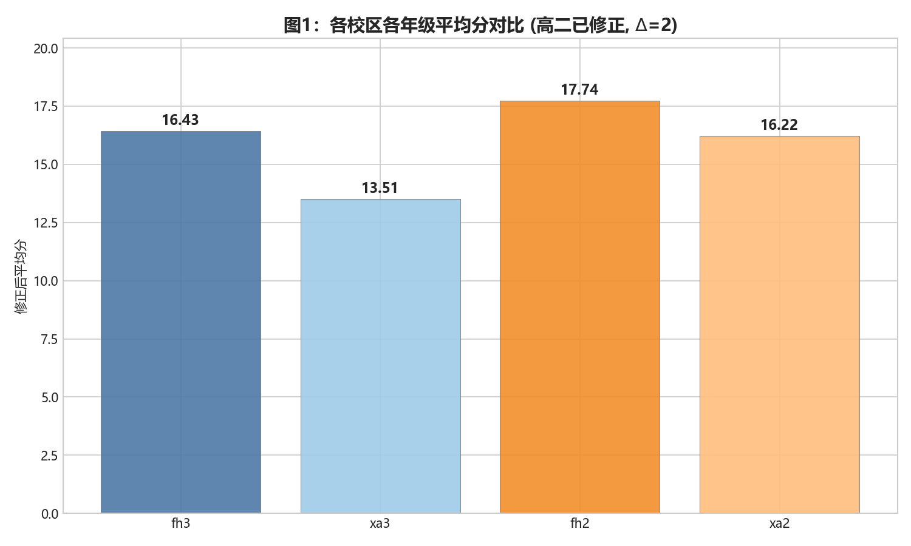
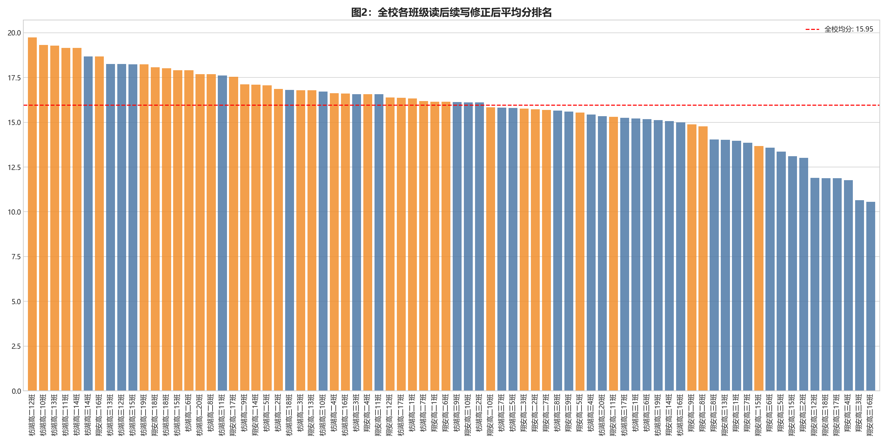
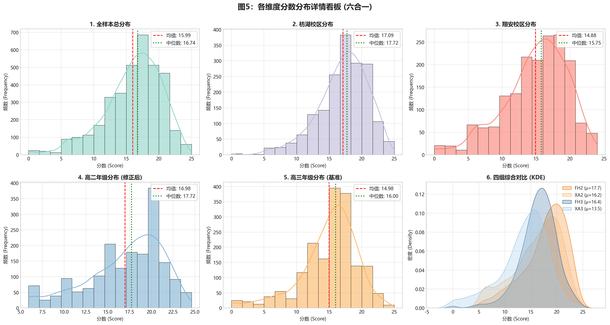
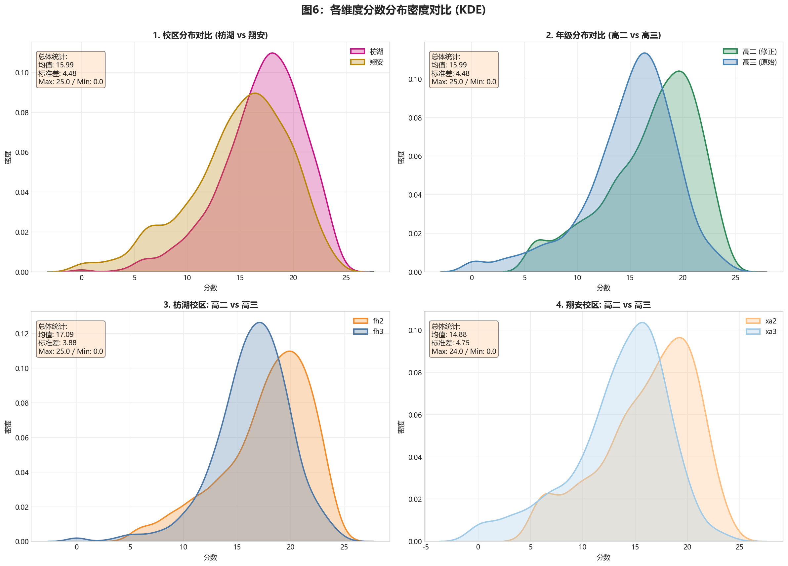
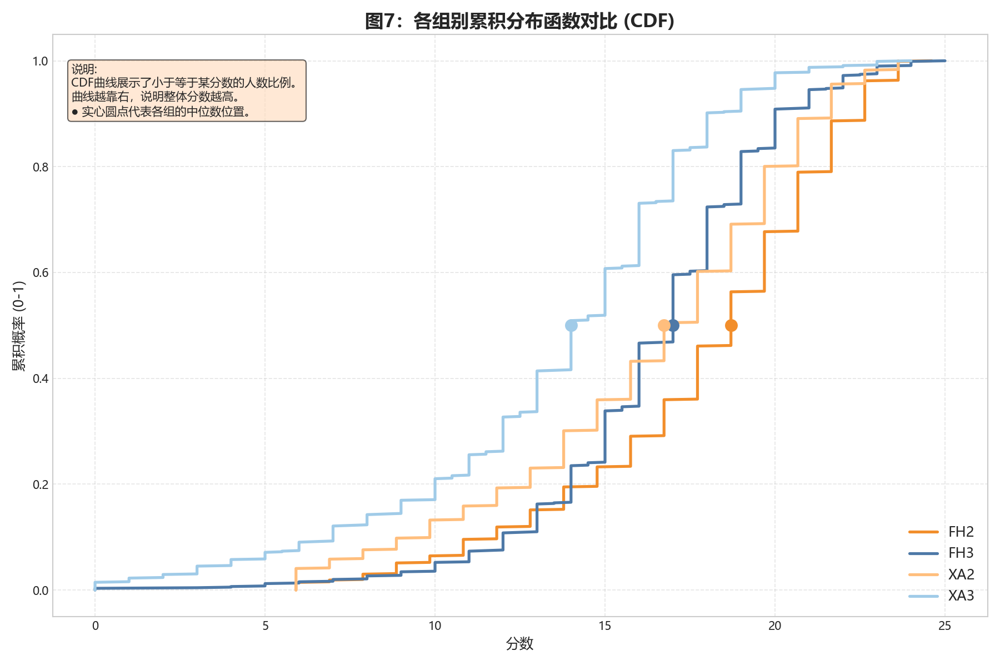
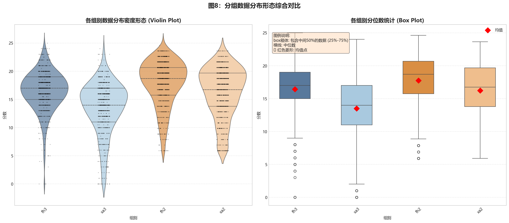

# 2025-2026学年 高二高三第二次月考 英语读后续写 “抓螳螂成功率”相关研究（20vs25分对标修正版）

欲研究本次考试该题各班得分情况、各校区各年段得分情况。为方便表述，我们称之为“抓螳螂成功率”。以 **fh2、fh3、xa2、xa3** 分别代表枋湖高二、枋湖高三、翔安高二、翔安高三。

本次数据来源为智学网（异议分数修改前），缺考考生未计入统计。

**核心前提：** 本研究基于一个假设，即同一个年级不同校区改卷标准基本统一，但高二（20分制）与高三（25分制）由于题目和学情不同，改卷标准和分数分布存在显著差异。

---

## 一、 引言：为何需要“等值换算”？

在本次第二次月考中，高二与高三采用了完全不同的读后续写题目，且满分不同（高二20分，高三25分）。

如果我们简单地将高二分数乘以 1.25 ($25/20$) 来对标高三，这种做法虽然直观，但犯了一个严重的统计学错误：**它忽略了两个群体分数的离散程度（方差）的差异。**

为了更科学地评估高二班级在高三评价体系下的相对竞争力，本次研究引入了教育测量学中经典的 **Z-score 线性等值法**。该方法的核心思想是：**一个学生在群体中的相对位置（排名百分位）是其能力的真实体现。** 我们将高二学生的相对位置，映射到高三的分数分布坐标系中。

### 1. 核心公式与参数

**修正公式：**
$$Score_{new} = (\mu_3 + \frac{Score_{raw} - \mu_2}{\sigma_2} \times \sigma_3) + \Delta$$

**公式解读：**
1.  $\frac{Score_{raw} - \mu_2}{\sigma_2}$：计算高二学生在自己年级中的 **Z分数（标准分）**，即他距离平均分有几个标准差。
2.  $\times \sigma_3$：将这个相对距离放到高三的尺度（标准差）上进行放大或缩小。
3.  $+ \mu_3$：平移到高三的平均分基准线上。
4.  $+ \Delta$：加上**能力偏移量**。本次设定 $\Delta = 2$ 分，这是考虑到高二学生相比高三学生，在词汇积累、做题经验和知识广度上客观存在的差距，给予的经验性补偿。

**本次实测数据参数：**
* **高二 (基准):** 均值 $\mu_2 = 11.25$, 标准差 $\sigma_2 = 4.43$ (方差较小，分布集中)
* **高三 (目标):** 均值 $\mu_3 = 14.98$, 标准差 $\sigma_3 = 4.36$ (方差较大，分化严重)

### 2. 深度分析：方差的陷阱与“放大效应”

为何不能简单折算？数据告诉我们，高三的标准差 ($\sigma_3 \approx 6.9$) 显著大于高二的标准差 ($\sigma_2 \approx 4.3$)。这意味着高三学生的分数两极分化非常严重，而高二学生的分数则咬得很紧。

**场景模拟（含金量的区别）：**

假如你在高二考了 **18.5分**。
* 在高二环境里，均值只有约 10分，标准差约 4分。你比均值高了 8.5分，大概领先了 **2个标准差 ($Z \approx 2$)**。在大家水平都很接近的环境里，能拉开2个标准差的差距，说明你具备极强的统治力，“含金量”极高。
* 当我们要把这个“$Z=2$ 的统治力”映射到高三环境时，高三的1个标准差是接近7分。那么领先2个标准差就意味着要比高三均值（约14分）高出 $2 \times 7 = 14$ 分。
* 再加上我们给的 $\Delta=2$ 分补偿，你的最终得分就会变成 $14 + 14 + 2 = 30$ 分（当然，实际上限是25分）。

**结论：** 由于高二方差小，高二高分段学生在同伴中的相对优势极大。当这种优势被映射到方差大的高三环境时，他们的分数会得到显著的“放大”。这符合统计学规律——在竞争激烈的窄赛道脱颖而出的人，到了宽赛道通常能跑得更远。反之，高二低分段的学生在修正后，分数也会被显著“拉低”。

---

## 二、样本概况与分布可视化

本次调查共有效统计 **3591** 个样本，分布如下：

* **fh2 (枋湖高二):** 899 人
* **fh3 (枋湖高三):** 899 人
* **xa2 (翔安高二):** 908 人
* **xa3 (翔安高三):** 885 人

下图清晰地展示了这种“方差放大效应”。请注意观察，高二原始分（红色虚线）的峰值很高且窄，说明大家分数很集中；而修正后的高二分数（橙色区域）分布变宽了，完美拟合了高三（蓝色区域）的分布形态。

---

## 三、各班级平均分详情 (修正后)

以下数据均基于 Z-score 修正后的得分进行统计。表格按先高三后高二，班级序号递增的顺序排列，翔安与枋湖左右对照。

| 校区 | 年级 | 班级 | 修正均分 | 人数 | 校区 | 年级 | 班级 | 修正均分 | 人数 |
| :---: | :---: | :---: | :---: | :---: | :---: | :---: | :---: | :---: | :---: |
| **翔安** | 高三 | 高三1班 | 13.96 | 51 | **枋湖** | 高三 | 高三1班 | 15.21 | 47 |
| **翔安** | 高三 | 高三2班 | 13.01 | 46 | **枋湖** | 高三 | 高三2班 | 16.10 | 48 |
| **翔安** | 高三 | 高三3班 | 10.65 | 48 | **枋湖** | 高三 | 高三3班 | 16.57 | 49 |
| **翔安** | 高三 | 高三4班 | 11.77 | 48 | **枋湖** | 高三 | 高三4班 | 15.43 | 51 |
| **翔安** | 高三 | 高三5班 | 13.36 | 53 | **枋湖** | 高三 | 高三5班 | 15.79 | 52 |
| **翔安** | 高三 | 高三6班 | 13.59 | 47 | **枋湖** | 高三 | 高三6班 | 15.18 | 51 |
| **翔安** | 高三 | 高三7班 | 13.85 | 55 | **枋湖** | 高三 | 高三7班 | 15.82 | 45 |
| **翔安** | 高三 | 高三8班 | 14.04 | 54 | **枋湖** | 高三 | 高三8班 | 15.66 | 51 |
| **翔安** | 高三 | 高三9班 | 15.59 | 54 | **枋湖** | 高三 | 高三9班 | 16.12 | 48 |
| **翔安** | 高三 | 高三10班 | 16.12 | 51 | **枋湖** | 高三 | 高三10班 | 16.71 | 51 |
| **翔安** | 高三 | 高三11班 | 16.56 | 56 | **枋湖** | 高三 | 高三11班 | 17.60 | 44 |
| **翔安** | 高三 | 高三12班 | 11.89 | 47 | **枋湖** | 高三 | 高三12班 | 18.25 | 48 |
| **翔安** | 高三 | 高三13班 | 14.03 | 53 | **枋湖** | 高三 | 高三13班 | 18.26 | 50 |
| **翔安** | 高三 | 高三14班 | 15.06 | 51 | **枋湖** | 高三 | 高三14班 | 18.67 | 47 |
| **翔安** | 高三 | 高三15班 | 13.10 | 50 | **枋湖** | 高三 | 高三15班 | 18.24 | 46 |
| **翔安** | 高三 | 高三16班 | 10.56 | 41 | **枋湖** | 高三 | 高三16班 | 15.00 | 32 |
| **翔安** | 高三 | 高三17班 | 11.88 | 41 | **枋湖** | 高三 | 高三17班 | 15.24 | 33 |
| **翔安** | 高三 | 高三18班 | 11.88 | 39 | **枋湖** | 高三 | 高三18班 | 16.80 | 48 |
| **翔安** | 高二 | 高二1班 | 16.15 | 49 | **枋湖** | 高三 | 高三19班 | 15.12 | 29 |
| **翔安** | 高二 | 高二2班 | 15.73 | 50 | **枋湖** | 高三 | 高三20班 | 15.34 | 29 |
| **翔安** | 高二 | 高二3班 | 15.75 | 51 | **枋湖** | 高二 | 高二1班 | 16.33 | 36 |
| **翔安** | 高二 | 高二4班 | 16.57 | 53 | **枋湖** | 高二 | 高二2班 | 16.85 | 50 |
| **翔安** | 高二 | 高二5班 | 15.54 | 52 | **枋湖** | 高二 | 高二3班 | 16.79 | 51 |
| **翔安** | 高二 | 高二6班 | 16.15 | 52 | **枋湖** | 高二 | 高二4班 | 16.61 | 48 |
| **翔安** | 高二 | 高二7班 | 15.68 | 54 | **枋湖** | 高二 | 高二5班 | 17.06 | 54 |
| **翔安** | 高二 | 高二8班 | 14.77 | 51 | **枋湖** | 高二 | 高二6班 | 17.91 | 47 |
| **翔安** | 高二 | 高二9班 | 14.88 | 54 | **枋湖** | 高二 | 高二7班 | 16.18 | 51 |
| **翔安** | 高二 | 高二10班 | 15.84 | 47 | **枋湖** | 高二 | 高二8班 | 17.68 | 54 |
| **翔安** | 高二 | 高二11班 | 15.30 | 55 | **枋湖** | 高二 | 高二9班 | 17.12 | 46 |
| **翔安** | 高二 | 高二12班 | 16.38 | 55 | **枋湖** | 高二 | 高二10班 | 19.31 | 54 |
| **翔安** | 高二 | 高二13班 | 16.78 | 46 | **枋湖** | 高二 | 高二11班 | 19.16 | 52 |
| **翔安** | 高二 | 高二14班 | 17.10 | 46 | **枋湖** | 高二 | 高二12班 | 19.73 | 48 |
| **翔安** | 高二 | 高二15班 | 13.67 | 26 | **枋湖** | 高二 | 高二13班 | 19.28 | 51 |
| **翔安** | 高二 | 高二16班 | 18.67 | 55 | **枋湖** | 高二 | 高二14班 | 19.14 | 47 |
| **翔安** | 高二 | 高二17班 | 17.53 | 57 | **枋湖** | 高二 | 高二15班 | 17.91 | 31 |
| **翔安** | 高二 | 高二18班 | 18.08 | 55 | **枋湖** | 高二 | 高二16班 | 16.61 | 31 |
| | | | - | - | **枋湖** | 高二 | 高二17班 | 16.36 | 39 |
| | | | - | - | **枋湖** | 高二 | 高二18班 | 18.02 | 40 |
| | | | - | - | **枋湖** | 高二 | 高二19班 | 18.23 | 35 |
| | | | - | - | **枋湖** | 高二 | 高二20班 | 17.69 | 34 |

 

### 1. 宏观对比：按校区和年级

汇总各组别均分如下：

| 组别代码 | 描述 | 修正后平均分 |
| :---: | :---: | :---: |
| **xa3** | 翔安高三 | 13.51 |
| **xa2** | 翔安高二 | 16.22 |
| **fh3** | 枋湖高三 | 16.43 |
| **fh2** | 枋湖高二 | 17.74 |

**数据解读：**
* **fh2 (枋湖高二)** 凭借其极高的原始均值和较小的方差，在经过 $\Delta=2$ 的等值修正后，以 **17.74** 的均分位居四大组别之首。
* **xa2 (翔安高二)** 紧随其后，均分也达到了 **16.22**，略高于高三的平均水平。
* 这表明在本次试题难度下，高二头部群体的英语读后续写能力（在各自评价体系内的相对位置），已经具备了极强的竞争力。

可视化对比图如下：

 

### 2. 微观对比：全校班级排行榜

为了更直观地看到每个班级在全校范围内的位置，我们绘制了全校班级均分排名图。橙色代表高二班级（修正分），蓝色代表高三班级（原始基准分）。

可以清晰地看到，高二的头部班级（橙色柱子）已经插入甚至领跑了整个排行榜的前列。

---

## 四、 总结与声明

1.  **高二竞争力分析**：在引入科学的 Z-score 等值及 $\Delta=2$ 的能力偏移补偿后，数据有力地证明了高二整体，尤其是枋湖高二，在本次读后续写模块中展现出了极高的相对竞争力。
2.  **关于方差的启示**：高三巨大的分数方差提示我们，随着复习的深入，学生群体内部的分化将不可避免地加剧。高二目前“齐步走”的状态终将被打破，尖子生需要利用好当前的领先优势，中坚力量则需警惕掉队。
3.  **声明**：本模型基于统计学假设，旨在提供一种跨年级比较的理论视角。实际能力受多种因素影响，本报告数据仅供内部教学研究参考，请勿过度解读或用于不恰当的排名。

### 附：详细分布图表

为了更深入地分析数据，我们生成了各维度的分数分布图（注：所有数据均已包含 Z-score 修正）：

